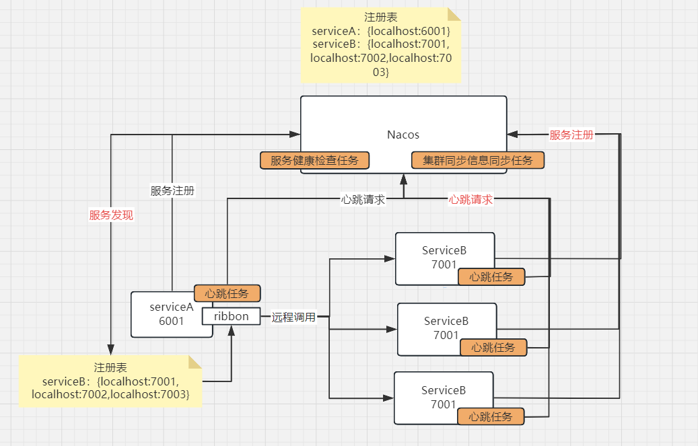
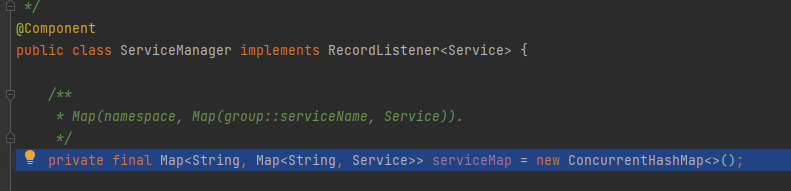
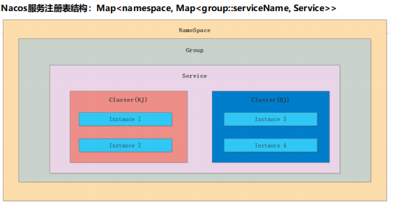
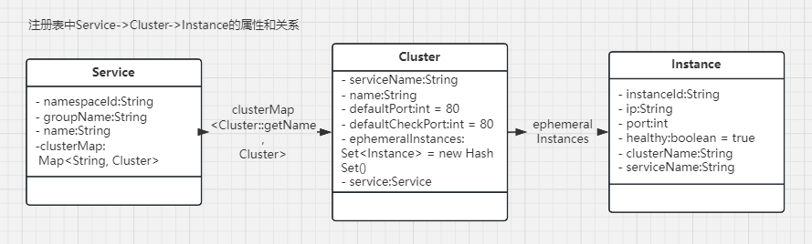
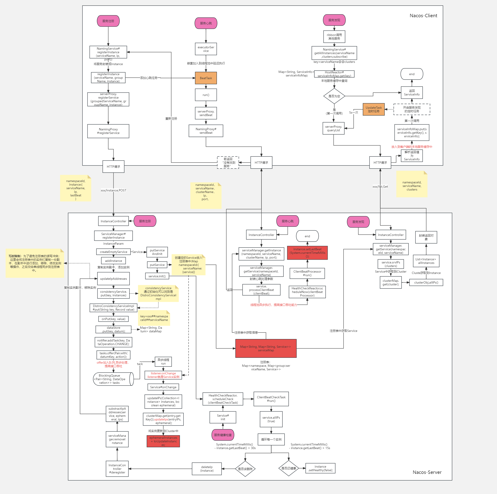

# phoenix
## 中国古代神话故事神兽-凤凰
  项目目的：参考nacos1.x与2.x源码,手写服务注册中心的核心逻辑.
  - 1.nacos1.x源码分析:
  - 2.phoenix-server端设计
  - 3.phoenix-client端设计
   
###  一、Nacos架构图：

###  二、Nacos核心功能点
1. 服务注册： 
    - 1.x版本：Nacos Client会通过发送REST请求的方式向Nacos Server注册自己的服务，提供自身的元数据，比如ip地址、端口等信
   息。Nacos Server接收到注册请求后，就会把这些元数据信息存储在一个双层的内存Map中。
    - 
    - 
    - 注册表中Server的关系
    - 
    - 2.x版本： 
   
2. 服务发现：
   - 1.x版本:服务消费者（Nacos Client）在调用服务提供者的服务时，会发送一个REST请求给Nacos Server，获取上面注册的服务清
        单，并且缓存在Nacos Client本地，同时会在Nacos Client本地开启一个定时任务定时拉取服务端最新的注册表信息更新到本地缓存
        服务同步：Nacos Server集群之间会互相同步服务实例，用来保证服务信息的一致性。
3. 服务心跳：在服务注册后，Nacos Client会维护一个定时心跳来持续通知Nacos Server，说明服务一直处于可用状态，防止被剔除。默
   认5s发送一次心跳。
   服务健康检查：Nacos Server会开启一个定时任务用来检查注册服务实例的健康情况，对于超过15s没有收到客户端心跳的实例会将它
   的healthy属性置为false(客户端服务发现时不会发现)，如果某个实例超过30秒没有收到心跳，直接剔除该实例(被剔除的实例如果恢复
   发送心跳则会重新注册)

### 核心流程:
- 
